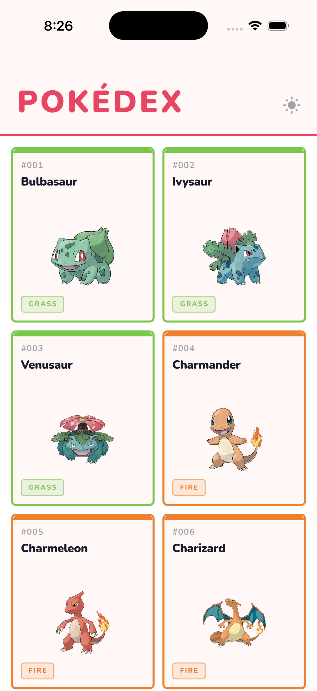
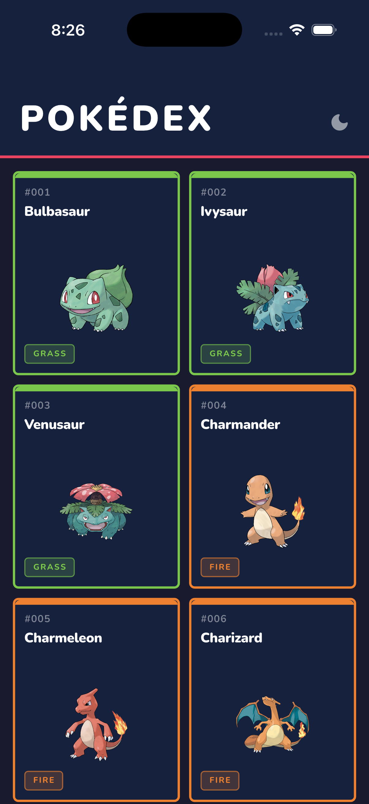
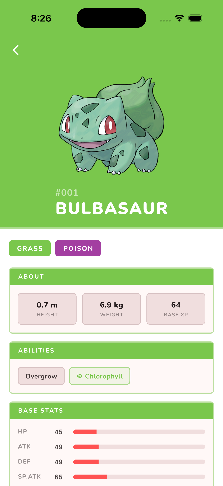
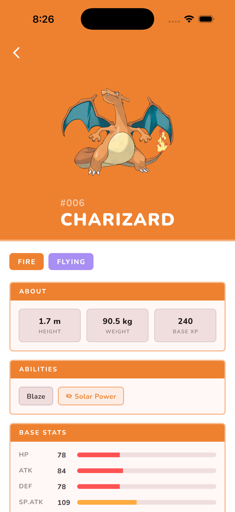
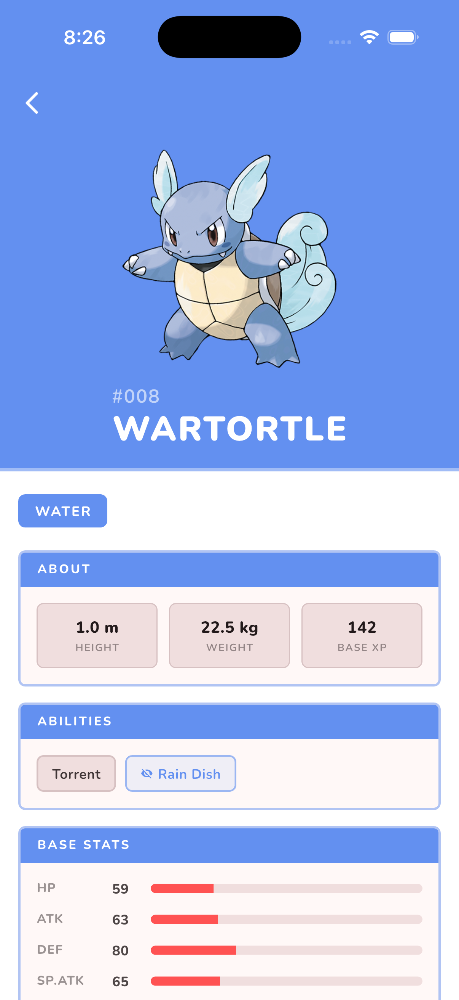

# 🔴 Pokédex

A production-quality Flutter application built with clean architecture, a bespoke design system, and a cache-first data strategy. Consumes the public [PokéAPI](https://pokeapi.co/) to browse and explore every Pokémon across all generations.

---

## Screenshots

<table>
  <tr>
    <td align="center"><b>Home — Light</b></td>
    <td align="center"><b>Home — Dark</b></td>
    <td align="center"><b>Detail — Grass</b></td>
    <td align="center"><b>Detail — Fire</b></td>
    <td align="center"><b>Detail — Water</b></td>
  </tr>
  <tr>
    <td></td>
    <td></td>
    <td></td>
    <td></td>
    <td></td>
  </tr>
</table>

---

## Features

- **Infinite-scroll grid** — paginated over the full Pokédex, auto-fetches on scroll
- **Type-coloured cards** — each card's border and badge use the Pokémon's actual element colour, resolved asynchronously and cached by Riverpod
- **Detail view** — full-bleed type-colour scaffold, official artwork, type chips, base stats, abilities
- **Hero animation** — sprite transitions seamlessly from card → detail header
- **Light / Dark mode** — toggled by **tapping** the `POKÉDEX` title (swipe-left = dark, swipe-right = light), persisted to Hive
- **Cache-first loading** — Hive serves the last-known list instantly with zero spinner; fresh data is fetched in the background and merged silently

---

## Architecture

The codebase follows a strict **three-layer architecture**:

```
UI (Views / Widgets)
    │
    ▼
State (Riverpod Providers / Notifiers)
    │
    ▼
Repository  ←── the only class allowed to touch Services
    │
    ├── NetworkService   (Dio — HTTP)
    └── HiveService      (Hive — disk)
```

### Directory layout

```
lib/
├── core/
│   ├── navigator/          # AppRouter — named routes, transitions, GlobalKey
│   ├── styles/             # TypeColors — 18 element types → brand Color
│   └── theme/              # AppTheme  — single source of truth for ThemeData
│
├── models/                 # Freezed + json_serializable value objects
│   ├── pokemon_detail.dart
│   └── pokemon_list_response.dart
│
├── providers/
│   ├── pokemon_providers.dart   # All Pokémon providers
│   └── theme_provider.dart      # ThemeNotifier (persisted preference)
│
├── repositories/
│   └── pokemon_repository.dart  # ← data-access boundary
│
├── services/
│   ├── network_service.dart     # Dio HTTP client
│   └── hive_service.dart        # Hive read/write (list + settings)
│
└── views/
    ├── home_view/
    │   ├── home_view.dart
    │   └── widgets/pokemon_card.dart
    └── pokemon_detail_view/
        └── pokemon_detail_page.dart
```

---

## State Management

All state is managed with **Riverpod 2**. Providers are composed bottom-up:

```
_networkServiceProvider   (Provider — private)
hiveServiceProvider       (Provider)
        │
        └──► pokemonRepositoryProvider   (Provider)
                    │
                    ├──► pokemonListProvider          (AsyncNotifierProvider)
                    ├──► pokemonDetailProvider         (FutureProvider.family)
                    └──► pokemonTypeColorProvider      (FutureProvider.family, derived)

hiveServiceProvider
        └──► themeProvider               (NotifierProvider)
```

| Provider | Type | Responsibility |
|---|---|---|
| `pokemonRepositoryProvider` | `Provider` | Composes network + cache into one API |
| `pokemonListProvider` | `AsyncNotifierProvider` | Cache-first list, pagination, bg refresh |
| `pokemonDetailProvider` | `FutureProvider.family` | Detail fetch by ID, Riverpod-cached |
| `pokemonTypeColorProvider` | `FutureProvider.family` | Derives type `Color` from detail cache |
| `themeProvider` | `NotifierProvider` | `ThemeMode`, persisted to Hive |

---

## Repository

`PokemonRepository` is the **only class** that may call `NetworkService` or `HiveService` for Pokémon data. Notifiers call the repository exclusively — no raw service references leak into feature code.

```dart
class PokemonRepository {
  Future<List<PokemonEntry>?> getCachedList();       // Hive
  Future<PokemonListResponse> fetchPage({int offset}); // Network
  Future<void>                persistList(entries);   // Hive
  Future<void>                clearCache();            // Hive
  Future<PokemonDetail>       fetchDetail(nameOrId);  // Network
}
```

---

## Caching Strategy

```
App launch
 ├─ Hive hit  →  render instantly (no spinner)
 │               └─ background fetch → merge if changed → persist
 └─ No cache  →  network fetch → render → persist

Scroll to bottom  →  fetchPage(offset) → append → persist growing list
Title tap         →  toggle ThemeMode  → persist bool to Hive settings box
```

Two separate Hive boxes are used so settings and list data never collide:

| Box | Key | Value |
|---|---|---|
| `pokemon_list_box` | `"pokemon_list"` | `List<String>` (JSON-encoded entries) |
| `settings_box` | `"is_dark_mode"` | `bool` |

---

## Design System

All design tokens live in [`AppTheme`](lib/core/theme/app_theme.dart). Nothing is hardcoded outside it.

```dart
// Colours
AppTheme.brandRed        // #E94560 — accent, AppBar indicator
AppTheme.darkSurface     // #1A1A2E — dark scaffold
AppTheme.darkAppBar      // #16213E — dark app bar / card surface
AppTheme.cardFallback    // #4A90A4 — type-colour placeholder

// Boxy design language
AppTheme.boxyRadiusPx    // 6.0
AppTheme.boxyRadius      // BorderRadius.all(Radius.circular(6))
AppTheme.cardBorderWidth // 2.5

// Theme objects
AppTheme.light  →  ThemeData  (white scaffold, system font, M3)
AppTheme.dark   →  ThemeData  (#1A1A2E scaffold)
```

The detail page uses **no hardcoded surface colours** — every container background and border is a semi-transparent white or black overlay on top of the Pokémon's type colour, so it remains legible in both modes across all 18 type colours.

---

## Navigation

All routing is centralised in [`AppRouter`](lib/core/navigator/app_router.dart):

- **Named routes** — `AppRoutes.home`, `AppRoutes.pokemonDetail`
- **Custom transitions** — fade for root, slide-up + fade for detail
- **`GlobalKey<NavigatorState>`** — enables navigation from outside the widget tree
- **`RouteObserver`** — logs push/pop/replace for debugging

---

## Tech Stack

| Concern | Package | Version |
|---|---|---|
| State management | `flutter_riverpod` | 2.6.1 |
| HTTP | `dio` | 5.x |
| Disk cache | `hive_flutter` | Latest |
| Models | `freezed` + `json_serializable` | 2.x |
| Image loading | `cached_network_image` | Latest |
| Typography | `google_fonts` (Nunito) | Latest |

---

## API Reference

Data from [PokéAPI](https://pokeapi.co/) — free, open, no auth required.

| Endpoint | Used for |
|---|---|
| `GET /pokemon?limit=20&offset=N` | Paginated Pokémon list |
| `GET /pokemon/{id}` | Full detail — types, stats, abilities, sprites |

Artwork served from the [PokeAPI/sprites](https://github.com/PokeAPI/sprites) GitHub CDN (`other.official-artwork.front_default`).

---

## Running Locally

```bash
git clone https://github.com/mayukhsil/pokedex.git
cd pokedex

flutter pub get
dart run build_runner build --delete-conflicting-outputs

flutter run
```

> Requires Flutter `^3.5.0` · Dart `^3.5.0`

---

*Built by [Mayukh Sil](https://github.com/mayukhsil)*
